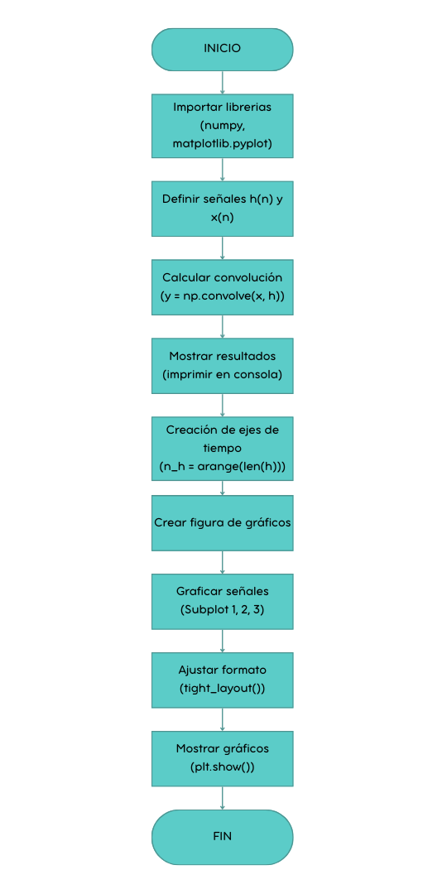
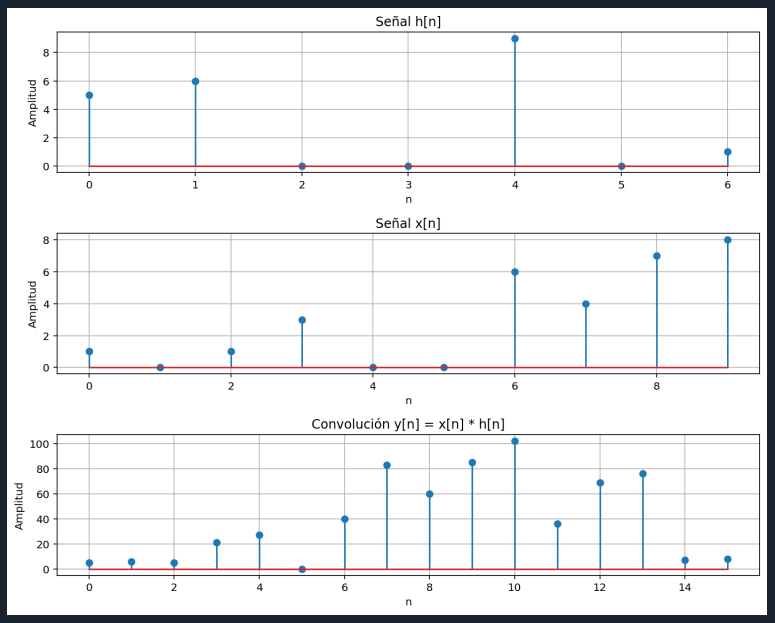
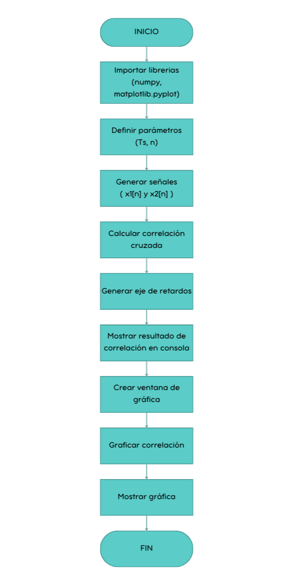

# Convolucion-y-coorelacion
## Segundo Laboratorio, procesamiento digital de señales

**Maria Camila Ospina Jara, Juan Felipe Serna Alarcón**

### Descripción
Esta práctica de laboratorio se centra en la aplicación de la convolución para determinar la respuesta de sistemas discretos, la correlación para medir la similitud entre señales y la Transformada de Fourier para el análisis espectral en el dominio de la frecuencia. 

### Introducción
En el análisis de señales y sistemas, existen operaciones matemáticas que permiten estudiar cómo se relacionan diferentes funciones o señales. Dos de las más importantes son la convolución y la correlación, las cuales se utilizan para analizar la interacción y similitud entre señales.

La convolución es una operación que combina dos funciones para describir su superposición. Este proceso consiste en desplazar una de las funciones sobre la otra, multiplicar sus valores en los puntos donde coinciden y sumar los productos obtenidos para generar una nueva función. Por otro lado, la correlación permite medir el grado de similitud entre dos señales cuando una se desplaza respecto a la otra.

Estas herramientas son ampliamente utilizadas en el procesamiento de señales, ya que permiten comprender mejor el comportamiento de los sistemas y la relación entre distintas señales.

### Desarrollo de la práctica 
### Parte A
Para ésta sección se crearon los sistemas h(n) y x(n), siendo h(n) los digitos del codigo de estudiante y x(n) los digitos del numero de cedula, con esto se encontró la señal y(n) resultante de la convolución de las dos señales, de la cual se obtuvo su representación gráfica y secuencial. Ésto se hizo a mano y programando en python, este apartado se realizo para todos los integrantes del grupo.

## Sección de código donde se hace la convolucion

```python

# Convolución
y = np.convolve(x, h)

# Mostrar resultado
print("Señal h[n]:", h)
print("Señal x[n]:", x)
print("Convolución y[n]:", y)

# Crear ejes de tiempo
n_h = np.arange(len(h))
n_x = np.arange(len(x))
n_y = np.arange(len(y))

```

#### Diagrama de flujo general del código :


```python

# Definir las señales
h = np.array([5, 6, 0, 0, 9, 0, 1])
x = np.array([1, 0, 1, 3, 0, 0, 6, 4, 7, 6])

```

#### Gráfico (Camila Ospina)



Representación secuencial: Señal resultante y[n] = 
[ 5  6  5 21 27  0 40 83 60 75 90 36 69 58  7  6]


```python 
# Definir las señales
x = np.array([1, 0, 1, 6, 8, 3, 4, 4, 4, 8])
h = np.array([5, 6, 0, 0, 8, 8, 7])
```

#### Gráfico (Juan Serna)


Representación secuencial: Señal resultante y[n] = 
[  5   6   5  36  84  71  53 100 163 194 160  85  92 124  92  56]


Ahora se hace la convolución a mano por cada integrante del grupo.

#### Manual (Camila Ospina): 


#### Manual (Juan Serna):


### Parte B
En este apartado se busco encontrar la correlación cruzada de 2 señales previamente estipuladas mostrando su representación gráfica junto a la secuencia resultante por medio de python teniendo encuenta los parametros dados:




```python

# Parámetros
Ts = 1.25e-3        # 1.25 ms
n = np.arange(0, 9) # 0 ≤ n < 9
# =========================
# Definición de señales
x1 = np.cos(2 * np.pi * 100 * n * Ts)
x2 = np.sin(2 * np.pi * 100 * n * Ts)
# =========================
# Correlación cruzada
r = np.correlate(x1, x2, mode='full')

# Eje de retardos
lags = np.arange(-len(x1)+1, len(x1))

# =========================
# Representación secuencial
print("Correlación cruzada r_x1x2[k] =")
print(r)

```
La correlacion resultante entre las 2 señales definidas fue
Correlación cruzada r_x1x2[k] =
[-2.44929360e-16 -7.07106781e-01 -1.50000000e+00 -1.41421356e+00
 -1.66533454e-16  2.12132034e+00  3.50000000e+00  2.82842712e+00
  8.81375476e-17 -2.82842712e+00 -3.50000000e+00 -2.12132034e+00
  3.33066907e-16  1.41421356e+00  1.50000000e+00  7.07106781e-01
  0.00000000e+00]


### Análisis

## Referencias
[1] M. Wyant, “Convolución,” MATLAB & Simulink. https://la.mathworks.com/discovery/convolution.html
[2] E. De Redacción De La Universidad Internacional De La Rioja, “¿Qué es un análisis de correlación? Características y Ejemplos,” UNIR México, Feb. 21, 2024. [Online]. Available: https://mexico.unir.net/noticias/economia/analisis-correlacion/
