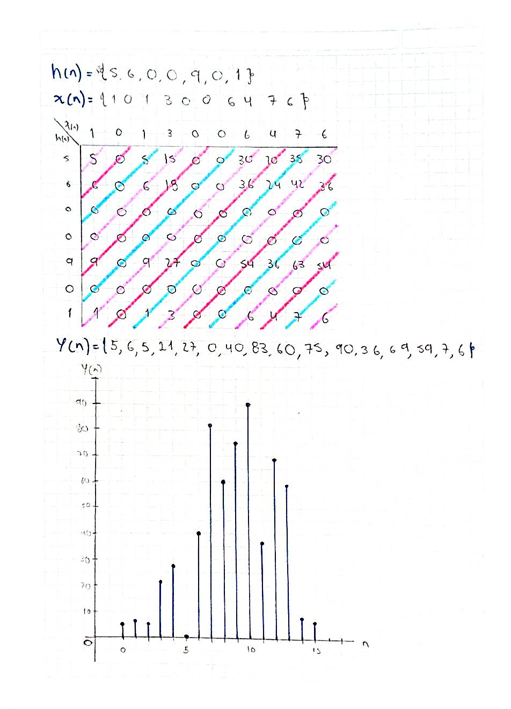

# Convolucion-y-coorelacion
## Segundo Laboratorio, procesamiento digital de señales

**Maria Camila Ospina Jara, Juan Felipe Serna Alarcón**

### Descripción
Esta práctica de laboratorio se centra en la aplicación de la convolución para determinar la respuesta de sistemas discretos, la correlación para medir la similitud entre señales y la Transformada de Fourier para el análisis espectral en el dominio de la frecuencia. 

### Introducción
En el análisis de señales y sistemas, existen operaciones matemáticas que permiten estudiar cómo se relacionan diferentes funciones o señales. Dos de las más importantes son la convolución y la correlación, las cuales se utilizan para analizar la interacción y similitud entre señales.

La convolución es una operación que combina dos funciones para describir su superposición. Este proceso consiste en desplazar una de las funciones sobre la otra, multiplicar sus valores en los puntos donde coinciden y sumar los productos obtenidos para generar una nueva función. Por otro lado, la correlación permite medir el grado de similitud entre dos señales cuando una se desplaza respecto a la otra.

Estas herramientas son ampliamente utilizadas en el procesamiento de señales, ya que permiten comprender mejor el comportamiento de los sistemas y la relación entre distintas señales.

### Desarrollo de la páctica 
### Parte A
Para ésta sección se crearon los sistemas h(n) y x(n), posteriormente se encontró la señal y(n) resultante de la convolución, su representación gráfica y secuencial. Ésto se hizo a mano y programando un código en python.

#### Código :

#### Gráfico (Camila Ospina)

#### Grafico (Juan Serna)

```python
# Convolución
y = np.convolve(x, h)

# Mostrar resultado
print("Señal h[n]:", h)
print("Señal x[n]:", x)
print("Convolución y[n]:", y)

# Crear ejes de tiempo
n_h = np.arange(len(h))
n_x = np.arange(len(x))
n_y = np.arange(len(y))

```

#### Manual (Camila Ospina): 



### Parte B


```python

```
### Análisis

## Referencias
[1] M. Wyant, “Convolución,” MATLAB & Simulink. https://la.mathworks.com/discovery/convolution.html
[2] E. De Redacción De La Universidad Internacional De La Rioja, “¿Qué es un análisis de correlación? Características y Ejemplos,” UNIR México, Feb. 21, 2024. [Online]. Available: https://mexico.unir.net/noticias/economia/analisis-correlacion/
